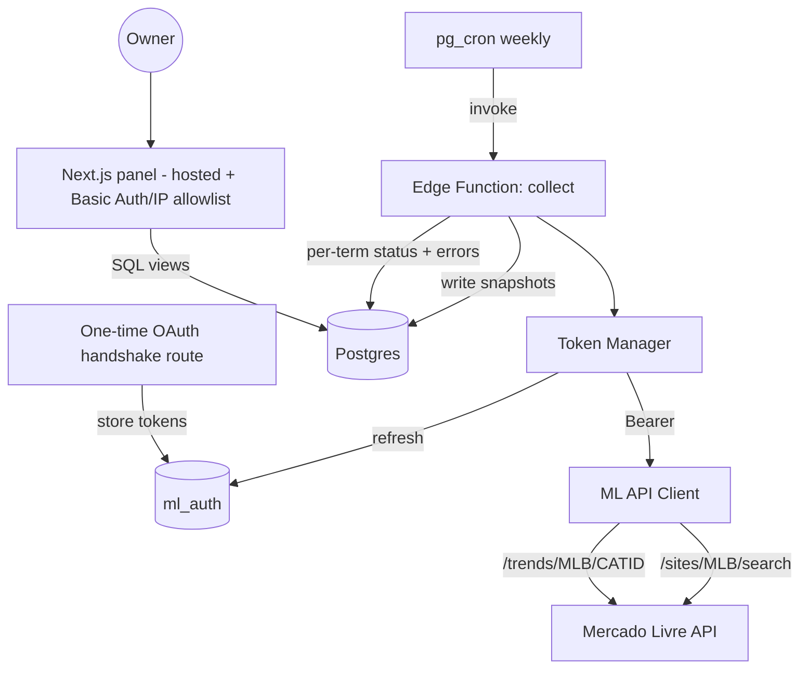

# Market Intelligence MVP Design

**Spec**: `.specs/features/market-intel-mvp/spec.md`
**Context**: `.specs/features/market-intel-mvp/context.md`
**Status**: Draft

---

## Research Findings (verified 2026-07-21 — do not re-assume)

Verified via live API calls + ML developer docs. Confidence noted per item.

| Finding | Detail | Confidence |
| ------- | ------ | ---------- |
| **Auth required for everything** | `GET https://api.mercadolibre.com/sites/MLB/categories` returned **403 without a Bearer token**. Search and trends also require `Authorization: Bearer <token>`. OAuth is a hard prerequisite for ALL collection. | **High** (observed 403 live) |
| **Trends endpoint format** | `https://api.mercadolibre.com/trends/MLB/{CATEGORY_ID}`. Returns ~50 entries: first 10 = highest-growth searches, next 20 = most-wanted, last 20 = most-popular-of-week. Refreshed **weekly** for BR. | High (docs) |
| **Pet category id** | Storefront references point to **`MLB1071` = "Animais"** as the top-level pet category. The commonly-cited `MLB1246` was **not** confirmed. → Resolve the real id live via authenticated `/sites/MLB/categories` before hardcoding. | Medium — **must confirm post-auth** |
| **Token lifetimes** | Access token valid **6h**; refresh token valid **6 months** and **rotates on each refresh** (ML returns a new refresh_token). Weekly interval (168h) ≫ 6h, so **every run must refresh first** and **persist the new refresh_token**. | High (docs) |
| **Known `/search` 403 gotcha** | Reports of `/sites/MLB/search` returning 403 even with a token valid for other endpoints — may require specific app scopes/permissions. Treat as a bootstrap-validation risk (AUTH-02). | Medium (community reports) |
| **Rate limits** | ML does not publish fixed public numbers; limits are per-app and enforced by 429. → Design conservatively (sequential + throttle + backoff), do not assume a specific ceiling. | Low — **do not fabricate numbers** |

**Open, deferred to first authenticated run:** exact pet `category_id` (candidate `MLB1071`), whether `/trends` needs a seller account, real 429 thresholds.

---

## Architecture Overview

A single weekly Supabase Edge Function (`collect`) is triggered by pg_cron. It refreshes the ML token, iterates the active seed terms (search) + configured pet category (trends), writes time-stamped snapshots to Postgres, and records per-term status/errors. A separate Next.js panel (hosted, protected) reads Postgres through SQL views and renders current state + evolution.



---

## Code Reuse Analysis

Greenfield project — no existing code to reuse. Consistency targets instead:

| Source | How it informs this build |
| ------ | ------------------------- |
| Existing Supabase projects (Adega Piloto, Pact) | Reuse Supabase client setup conventions, env-var patterns, migration workflow. |
| Standard ML OAuth flow | Authorization-code grant + refresh rotation (documented pattern, not invented). |

### Integration Points

| System | Integration Method |
| ------ | ------------------ |
| Mercado Livre API | HTTPS + `Authorization: Bearer`; token refreshed per run from `ml_auth`. |
| Supabase Postgres | Edge Function writes via service role; panel reads via SQL views. |
| pg_cron / pg_net | Weekly schedule invokes the Edge Function HTTP endpoint. |

---

## Components

### Token Manager

- **Purpose**: Keep a valid ML access token available for a run, rotating and persisting the refresh token.
- **Location**: `supabase/functions/collect/token.ts`
- **Interfaces**:
  - `getAccessToken(): Promise<string>` — reads tokens from Supabase Vault, refreshes (access token always stale between weekly runs), persists rotated refresh_token back to Vault, returns fresh access token.
- **Dependencies**: Supabase Vault (`vault.create_secret` / `vault.decrypted_secrets`), ML `/oauth/token` endpoint, service-role DB access.
- **Reuses**: Standard OAuth refresh-grant pattern.

### ML API Client

- **Purpose**: Thin typed wrapper over the two ML endpoints with throttle + retry/backoff.
- **Location**: `supabase/functions/collect/ml-client.ts`
- **Interfaces**:
  - `search(query: string, opts): Promise<SearchResult[]>` — `GET /sites/MLB/search?q=&limit=`
  - `trends(categoryId: string): Promise<TrendEntry[]>` — `GET /trends/MLB/{categoryId}`
- **Dependencies**: Token Manager. Handles 429/5xx with exponential backoff; surfaces per-call failure without throwing the whole run.
- **Reuses**: n/a.

### Collector (orchestrator)

- **Purpose**: Run the weekly collection: open a run, loop seeds, write snapshots + per-term status, close run.
- **Location**: `supabase/functions/collect/index.ts`
- **Interfaces**: HTTP handler (invoked by cron). Returns run summary.
- **Dependencies**: Token Manager, ML API Client, Snapshot Repository.
- **Reuses**: n/a.

### Snapshot Repository

- **Purpose**: All DB writes for a run (runs, search_snapshots, trend_snapshots, run_terms, collection_errors).
- **Location**: `supabase/functions/collect/repository.ts`
- **Interfaces**: `startRun()`, `saveSearchSnapshot()`, `saveTrendSnapshot()`, `markTermStatus()`, `logError()`, `finishRun()`.
- **Dependencies**: Supabase client (service role).

### OAuth Bootstrap route

- **Purpose**: One-time authorization-code exchange to seed `ml_auth`.
- **Location**: `app/api/ml-auth/callback/route.ts` (in the panel app).
- **Interfaces**: `GET /api/ml-auth/callback?code=` → exchange → store tokens in Vault. This is the fixed HTTPS redirect URI registered with the ML app (stable, hosted — no ngrok needed for re-auth).
- **Dependencies**: ML `/oauth/token`, Supabase Vault. Runs on setup and any manual re-auth.

### Panel

- **Purpose**: Simple internal web views over the data.
- **Location**: `app/` (Next.js).
- **Interfaces**: Server components reading SQL views: price bands, top items, rising products, rising terms — per seed term, with a single-run fallback state.
- **Dependencies**: Postgres views. Deployed behind **HTTP Basic Auth via Next middleware** (works regardless of access location — no fixed-IP dependency) (PANEL-04).

---

## Data Models

Design principle: **store raw snapshots, derive analytics in SQL views.** Never mutate captured values (edge case: don't "correct" sold_quantity drops).

```typescript
// Config: the curated seed list (search keywords)
interface SeedTerm {
  id: string
  query: string            // e.g. "petisco natural cachorro"
  priority: 'high' | 'normal'
  resultLimit: number      // top-N to capture: 100 for high, 50 for normal
  active: boolean
  createdAt: string
}

// Config: pet categories to pull /trends for (resolved live post-auth)
interface TrendCategory {
  id: string               // e.g. "MLB1071" (confirm before use)
  label: string
  active: boolean
}

// One row per weekly execution
interface CollectionRun {
  id: string
  startedAt: string
  finishedAt: string | null
  status: 'running' | 'complete' | 'partial' | 'failed'
  notes: string | null
}

// Per-term outcome within a run — distinguishes empty (signal) from failed
interface RunTerm {
  runId: string
  seedTermId: string
  status: 'ok' | 'empty' | 'failed'
  itemsCollected: number
}

// Core: search results, many rows per term per run
interface SearchSnapshot {
  id: string
  runId: string
  seedTermId: string
  mlItemId: string         // stable across runs → item evolution (HIST-02)
  title: string
  price: number
  currency: string
  soldQuantity: number     // cumulative; stored raw
  availableQuantity: number | null
  sellerId: string
  sellerNickname: string | null
  listingType: string | null
  freeShipping: boolean | null
  permalink: string | null
  position: number         // rank within the term's result page
  capturedAt: string
}

// From /trends per category per run
interface TrendSnapshot {
  id: string
  runId: string
  categoryId: string
  keyword: string
  trendType: 'rising' | 'most_wanted' | 'popular'
  position: number
  capturedAt: string
}

// Partial-failure log (COLLECT-03)
interface CollectionError {
  id: string
  runId: string
  seedTermId: string | null
  stage: 'auth' | 'search' | 'trends' | 'write'
  httpStatus: number | null
  message: string
  capturedAt: string
}

// ML tokens live in Supabase Vault (NOT a plain table).
// Stored as named secrets via vault.create_secret / read via vault.decrypted_secrets.
// Secrets: `ml_access_token`, `ml_refresh_token`, `ml_token_expires_at`.
// Rationale: live credentials to the ML account — Vault is near-zero extra effort and real security gain.
```

**Derived SQL views (analytics, not stored):**

- `v_price_band` — per run per term: `min / median / max` price from `search_snapshots`.
- `v_top_items` — per run per term: top N by `sold_quantity`.
- `v_item_evolution` — per `mlItemId`: price + sold_quantity across runs (HIST-01/HIST-02).
- `v_rising_products` — largest `sold_quantity` delta between the two latest runs (PANEL-02).
- `v_rising_terms` — `trend_snapshots` where `trendType='rising'` for the latest run.

**Key indexes:** `search_snapshots(seed_term_id, captured_at)`, `search_snapshots(ml_item_id)`, `search_snapshots(run_id)`, `trend_snapshots(run_id)`.

**Relationships:** `collection_runs 1—N run_terms / search_snapshots / trend_snapshots / collection_errors`; `seed_terms 1—N search_snapshots / run_terms`.

---

## Error Handling Strategy

| Error Scenario | Handling | User Impact (panel) |
| -------------- | -------- | ------------------- |
| Token refresh fails | Abort run, `run.status = failed`, log `stage='auth'` | Banner: last run failed (auth) |
| Single term 429/5xx | Backoff + retry; if still failing → `run_term.status='failed'` + `collection_errors`, continue | Gap marked for that term |
| Term returns 0 results | `run_term.status='empty'`, no snapshot rows | Shown as "no listings" (signal, not error) |
| `/trends` unavailable / access-restricted | Skip trends, flag run note, continue with search | Rising-terms view marked unavailable that run |
| Partial run | `run.status='partial'` | Panel renders what exists, marks gaps |
| sold_quantity decreases run-over-run | Stored raw, no correction | Evolution shows the dip as-is |

---

## Tech Decisions (non-obvious only)

| Decision | Choice | Rationale |
| -------- | ------ | --------- |
| Refresh token every run | Always refresh at run start | Access token (6h) always expired by the weekly (168h) cadence; must rotate + persist new refresh_token. |
| Token storage | **Supabase Vault** | Live ML-account credentials; Vault is near-zero extra effort (`vault.create_secret` / `vault.decrypted_secrets`) with real security gain vs a plain table. |
| Redirect URI | Fixed route in the hosted panel (`/api/ml-auth/callback`) | OAuth needs a stable public HTTPS redirect; a local script would need ngrok on every manual re-auth (inevitable given 6h/rotating tokens). |
| Result depth per term | **top 100 (high priority) / top 50 (normal)** | DB volume is trivial (13 terms × ~75 avg × 52 wks = tiny); depth goes where the business decision is most critical (entry product). |
| Panel protection | **HTTP Basic Auth (Next middleware)** | IP allowlist needs a fixed IP; remote/async work = variable IP. Basic Auth works anywhere, less maintenance. |
| Store raw, derive in views | SQL views for analytics | Keeps snapshots immutable; honors "don't correct anomalies"; cheap to add new views. |
| Empty vs failed distinction | `run_terms.status` | Edge case: empty result is signal, not an error — must be queryable separately from failures. |
| Category id not hardcoded | Resolve `MLB1071?` live post-auth | Research could not confirm the exact id; hardcoding a wrong id silently breaks `/trends`. |
| Scheduler | pg_cron + pg_net → Edge Function | Native to Supabase; no external scheduler; consistent with stack. |
| De-risk `/search` scope first | Validation spike before pipeline | If the `/search` 403 gotcha is real, it reorders all downstream work — validate token scope against `/search` before building. |

---

## Requirement Coverage

| Requirement | Covered by |
| ----------- | ---------- |
| COLLECT-01..04 | Collector + ML Client + Token Manager |
| HIST-01..03 | `search_snapshots` (ml_item_id) + `v_item_evolution` / `v_price_band` |
| PANEL-01..03 | Panel + `v_price_band` / `v_top_items` / `v_rising_products` / `v_rising_terms` |
| PANEL-04 | Panel middleware (Basic Auth / IP allowlist) |
| AUTH-01..03 | OAuth Bootstrap route + Token Manager + graceful degradation |
